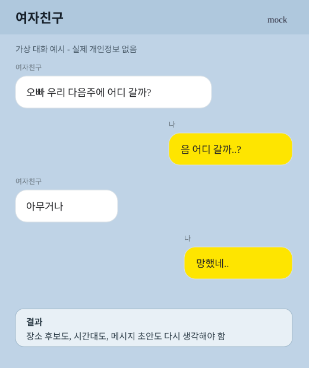
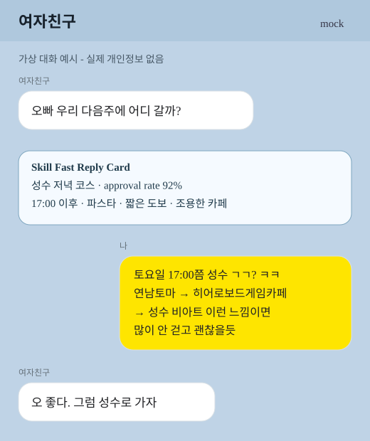

# "데이트는 즐겁지만 데이트 코스 계획은 업무다"

## 카카오톡 Export 데이트 플래너

Codex Skillathon 제출물입니다. 사용자가 승인한 **카카오톡 대화 내보내기 `.txt` 파일**을 분석해 데이트 조건을 추출하고, 구체적인 데이트 코스, 페르소나 기반 점수, 바로 보낼 카카오톡 메시지 초안을 생성합니다.

기본 흐름은 **카카오톡 export 파일 기반**입니다. 이 저장소는 카카오톡 내부 DB를 읽지 않고, 화면 캡처를 쓰지 않고, 메시지를 자동 전송하지 않습니다.

## 제출 Skill

- 메인 Skill: `skills/kakao-export-date-planner/SKILL.md`
- 제출 설명서: `SUBMISSION.md`
- 샘플 결과: `report.md`
- 로컬 데이트 코스 DB: `data/date-memory.json`

## 승인 범위

필수 입력:

- `chat_export_file`: 사용자가 제공한 카카오톡 `.txt` 내보내기 파일
- `approved_contact_or_room`: 사용자가 분석을 승인한 특정 상대 또는 채팅방
- `planning_goal`: `date_course_recommendation`

Skill은 승인된 export 파일과 승인된 상대/방만 처리합니다. 코스 메타데이터, 장소 후보, 점수, 메시지 초안은 저장하지만 카카오톡 원문은 저장하지 않습니다.

## 빠른 검증

결정적 샘플을 실행합니다.

```bash
npm run analyze:sample
```

기대 결과:

- `report.md`가 다시 생성됩니다.
- `data/date-memory.json`이 업데이트됩니다.
- `data/sample-kakao-export.txt`에서 날짜, 시간, 지역, 취향을 추출합니다.
- 구체 장소, approval score, 소스 채널 상태, 카카오톡 메시지 초안을 생성합니다.

## 예시

아래 두 이미지는 실제 카카오톡 캡처가 아니라, `data/sample-kakao-export.txt`를 바탕으로 만든 가상 대화 예시입니다. 왼쪽은 코스 계획이 대화에서 막히는 상황이고, 오른쪽은 Skill이 대화를 분석해 바로 보낼 제안 메시지까지 만든 상황입니다.

| Skill 없이 막히는 흐름 | Skill 사용 후 제안 흐름 |
| --- | --- |
|  |  |

이 예시에서 사용자가 하는 일:

1. 카카오톡에서 본인이 승인한 특정 방의 대화를 `.txt`로 내보냅니다. 예시는 `여자친구` 방입니다.
2. 내보낸 파일을 `data/inbox`에 넣거나, 샘플 검증용으로 `npm run analyze:sample`을 실행합니다.
3. 생성된 `report.md` 또는 `data/reports/latest-report.md`에서 추천 코스와 Fast Reply Card를 확인합니다.
4. 마음에 드는 메시지 초안을 직접 복사해 카카오톡에 붙여넣고, 필요하면 말투를 조금 고쳐 보냅니다.

AI가 하는 일:

1. 분석 범위가 승인된 상대/방인지 확인합니다.
2. export 원문에서 날짜, 시간대, 지역, 음식, 이동, 날씨, 예산 제약을 추출합니다.
3. 상대의 데이트 페르소나와 사용자의 카톡 말투 페르소나를 만듭니다.
4. `data/date-memory.json`에서 이전 추천, 가본 곳, 거절한 곳, 점수 이력을 읽습니다.
5. 장소 후보를 조사하고 네이버 지도, 네이버 블로그, 인스타그램, 공식 페이지 확인 상태를 분리해 정리합니다.
6. 후보 코스를 만들고 Persona Judge가 approval score와 approval rate를 계산합니다.
7. 사용자 말투에 맞춘 카카오톡 메시지 초안을 만들고, 코스/장소/점수/메시지 이력을 DB에 저장합니다.

입력 export 예시:

```txt
여자친구 : 이번 주말에 시간 돼?
나 : 토요일이면 괜찮아. 어디 갈까?
여자친구 : 성수 오랜만에 가고 싶긴 해.
여자친구 : 낮에는 일이 있어서 오후 5시 이후가 좋아.
여자친구 : 파스타 좋고, 너무 비싼 곳은 좀 부담돼.
여자친구 : 오래 걷는 건 싫고 역에서 가까운 데면 좋겠다.
여자친구 : 응 조용하고 자리 넓은 카페 있으면 좋겠다.
여자친구 : 홍대는 너무 자주 갔고 사람 많아서 이번엔 별로야.
여자친구 : 한남은 아직 안 가봤는데 언젠가 가보고 싶어.
나 : 담주 성수 ㄱㄱ?
나 : 너무 빡세게 말고 밥 먹고 카페 정도면 좋을듯
```

처리 과정 예시:

| 입력 문장 | AI가 읽는 의미 | 결과에 반영되는 방식 |
| --- | --- | --- |
| `이번 주말에 시간 돼?` | 데이트 계획 의도 발생 | 코스 추천 플로우를 시작합니다. |
| `오후 5시 이후가 좋아` | 저녁 시간대 선호 | 브런치, 낮 전시, 오전 코스는 제외합니다. |
| `파스타 좋고, 너무 비싼 곳은 좀 부담돼` | 파스타 선호와 예산 민감도 | 중저가 파스타 후보를 우선 검색합니다. |
| `오래 걷는 건 싫고 역에서 가까운 데` | 짧은 도보, 역 근처 선호 | 장소 간 이동 거리가 짧은 코스만 남깁니다. |
| `조용하고 자리 넓은 카페` | 조용한 카페 선호 | 카페 후보에서 좌석, 분위기, 혼잡도를 봅니다. |
| `홍대는 너무 자주 갔고 사람 많아서 별로야` | 자주 간 곳, 혼잡 회피 | 홍대 코스의 우선순위를 낮춥니다. |
| `한남은 아직 안 가봤는데 언젠가 가보고 싶어` | 미방문 관심 지역 | 성수 대안 후보로 저장합니다. |
| `담주 성수 ㄱㄱ? ... 좋을듯` | 사용자 말투 특징 | 초안에 `ㄱㄱ`, `ㅋㅋ`, `좋을듯` 같은 톤을 반영합니다. |

Skill이 추출하는 신호:

```txt
날짜: 토요일
시간: 17:00 이후
지역 후보: 성수, 한남, 홍대
선호: 파스타, 조용하고 자리 넓은 카페
제약: 중저가, 짧은 도보, 역 근처, 저녁 시간대
낮은 우선순위: 홍대 (자주 감, 사람 많음)
```

지역 정렬 예시:

```txt
1. 성수: 현재 긍정 후보, 오랜만에 가고 싶은 곳
2. 한남: 아직 안 가봤고 가보고 싶은 곳
3. 홍대: 너무 자주 갔고 사람 많아서 낮은 우선순위
```

추천 코스 예시:

```txt
성수 비 오는 날 실내 중심 코스
- 17:00 연남토마 성수점
- 19:20 히어로보드게임카페 성수점
- 21:00 성수 비아트
- approval score: 100/100
```

최종 산출 예시:

```txt
Top course: 성수 저녁 실내 중심 코스
이유: 오후 5시 이후, 파스타, 짧은 도보, 조용한 카페 조건을 모두 만족
추천 장소: 연남토마 성수점 -> 히어로보드게임카페 성수점 -> 성수 비아트
approval score: 100/100
approval rate: 92%
대안 후보: 한남 저녁 카페 코스
DB 업데이트: 성수 후보 점수 상승, 홍대 우선순위 하락, 한남 미방문 관심 지역 저장
```

바로 붙여넣을 카카오톡 메시지 예시:

```txt
토요일 17:00쯤 성수 ㄱㄱ? ㅋㅋ
17:00 연남토마 성수점 → 19:20 히어로보드게임카페 성수점 → 21:00 성수 비아트
이런 느낌이면 많이 안 걷고 괜찮을듯
```

전체 샘플 결과는 `report.md`에서 확인할 수 있습니다.

## Export Inbox 모드

사용자 개입을 줄이려면 다음을 실행합니다.

```bash
npm run watch:exports
```

그 다음 사용자가 승인한 카카오톡 export `.txt` 파일을 아래 폴더에 넣습니다.

```txt
data/inbox
```

watcher가 최신 export 파일을 감지하고 Skill 데모 분석기를 실행해 다음 파일을 갱신합니다.

- `data/reports/latest-report.md`
- `report.md`

즉 사용자는 **카톡 내보내기 → inbox에 넣기 → 추천 메시지 붙여넣기**만 하면 됩니다.

## Skill이 하는 일

승인된 export에서 다음을 추론합니다.

- 날짜와 만나는 시간
- 지역과 이동 힌트
- 음식, 카페, 활동 취향
- 예산 민감도
- 날씨와 도보 제약
- 가본 곳, 가보고 싶은 곳, 싫어한 곳
- 상대의 데이트 페르소나
- 사용자의 카톡 말투 페르소나

그 다음 다음 결과를 생성합니다.

- 지역/장소 후보 정렬
- 구체적인 데이트 코스
- 네이버 지도 / 네이버 블로그 / 인스타그램 / 공식 페이지 소스 상태
- Persona Judge approval score와 approval rate
- 카카오톡 Fast Reply Card
- 지속 업데이트되는 데이트 코스 DB

## Persona Judge란?

Persona Judge는 추천 코스가 상대와 사용자에게 얼마나 잘 맞는지 평가하는 내부 검토 단계입니다. 별도의 실제 사람이나 외부 심사 서비스가 아니라, export 대화에서 만든 두 가지 페르소나를 기준으로 후보 코스를 다시 점검하는 역할입니다.

- 상대 페르소나: 좋아하는 음식, 싫어하는 분위기, 걷기 허용 범위, 예산 민감도, 자주 간 지역, 가보고 싶은 지역
- 사용자 페르소나: 실제 카카오톡 말투, 제안 방식, 너무 길게 설명하지 않는 정도, 선호하는 데이트 리듬

Persona Judge는 각 후보 코스를 다음 기준으로 봅니다.

- 시간 적합성: 만나는 시간이 오후 5시 이후라면 낮 코스와 브런치 후보를 낮게 평가합니다.
- 취향 적합성: 파스타, 조용한 카페, 실내 활동처럼 대화에서 나온 신호를 우선 반영합니다.
- 제약 위반 여부: 오래 걷기, 높은 가격대, 웨이팅, 너무 붐비는 지역 같은 회피 조건을 감점합니다.
- 새로움과 반복도: 이미 자주 간 홍대는 낮추고, 가보고 싶다고 말한 한남은 대안 후보로 남깁니다.
- 메시지 자연스러움: 추천 결과를 사용자의 말투로 바꿨을 때 카카오톡에 바로 보낼 수 있는지 확인합니다.

결과는 `approval score`와 `approval rate`로 표시합니다. 이 점수는 자동 확정이 아니라 **사용자가 빠르게 고를 수 있게 돕는 추천 우선순위**입니다. Skill은 메시지를 자동 전송하지 않고, 사용자가 마지막으로 확인하고 수정해 보내는 구조입니다.

## 구체 장소 리서치

샘플은 `references/seongsu-place-research.md`의 번들 리서치 데이터를 사용합니다. 샘플 코스는 `근처 식사` 같은 추상 표현이 아니라 구체 장소를 사용합니다.

- `투파인드피터 서울성수점`
- `연남토마 성수점`
- `성수 비아트`
- `히어로보드게임카페 성수점`

실제 사용에서는 Codex 실행 시 `external_search=allowed`를 승인해 최신 정보를 검증합니다. 이때 카카오톡 원문은 웹 검색에 보내지 않고 요약된 검색어만 사용합니다.

소스 채널은 분리해서 봅니다.

- 네이버 지도: 현재 영업시간, 거리, 방문자 리뷰, 예약/웨이팅, 메뉴/가격
- 네이버 블로그: 긴 후기, 데이트 맥락, 사진, 협찬 가능성, 반복 장단점
- 인스타그램: 공개 위치/태그 기반 분위기, 사진 적합성, 혼잡 힌트
- 공식 페이지: 영업시간, 예약, 메뉴, 공지

## 데이트 코스 DB

`data/date-memory.json`은 다음을 저장합니다.

- 추천한 코스
- 구체 장소
- approval score와 score history
- `suggested`, `selected`, `visited`, `liked`, `rejected` 같은 코스 상태
- 사용한 메시지 초안
- 요약된 페르소나 스냅샷
- 요약된 검색 쿼리 이력

카카오톡 원문은 저장하지 않습니다. 다음 실행에서는 이 DB를 사용해 거절했거나 너무 자주 나온 코스를 피하고, 업데이트된 상대 페르소나 기준으로 기존 코스를 다시 점수화하며, 반복 검색 시간을 줄입니다.

## 안전 가드레일

- 사용자가 제공한 카카오톡 export 파일만 분석합니다.
- 승인된 상대 또는 채팅방만 처리합니다.
- 카카오톡 내부 파일, 암호화 DB, 자격증명, 숨겨진 메시지, 스크린샷에 접근하지 않습니다.
- 카카오톡 원문을 외부 서비스로 보내지 않습니다.
- 웹 검색에는 요약된 검색어만 사용합니다.
- 비공개 인스타그램 계정을 스크래핑하거나 로그인을 우회하지 않습니다.
- 비밀번호, OTP, API key, 계좌번호, 주민등록번호 등 민감 정보가 있으면 중단하거나 삭제합니다.
- 메시지 초안은 사용자가 수정해 보내는 제안일 뿐, Skill이 자동 전송하지 않습니다.
