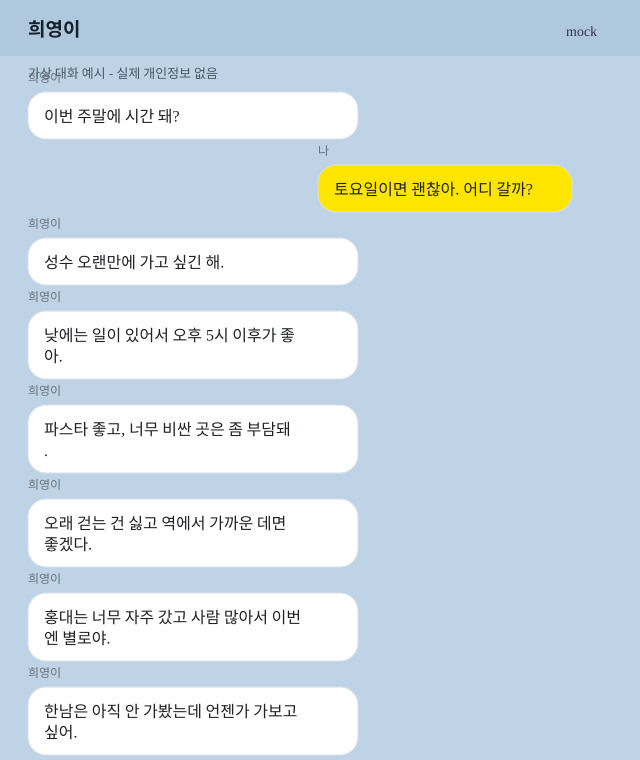

# 카카오톡 Export 데이트 플래너

Codex Skillathon 제출물입니다. 사용자가 승인한 **카카오톡 대화 내보내기 `.txt` 파일**을 분석해 데이트 조건을 추출하고, 구체적인 데이트 코스, 페르소나 기반 점수, 바로 보낼 카카오톡 메시지 초안을 생성합니다.

기본 흐름은 **카카오톡 export 파일 기반**입니다. 이 저장소는 카카오톡 내부 DB를 읽지 않고, 화면 캡처를 쓰지 않고, 메시지를 자동 전송하지 않습니다.

## 제출 Skill

- 메인 Skill: `skills/kakao-export-date-planner/SKILL.md`
- 제출 설명서: `SUBMISSION.md`
- 샘플 결과: `report.md`
- 로컬 데이트 코스 DB: `data/date-memory.json`

## 승인 범위

필수 입력:

- `chat_export_file`: 사용자가 제공한 카카오톡 `.txt` 내보내기 파일
- `approved_contact_or_room`: 사용자가 분석을 승인한 특정 상대 또는 채팅방
- `planning_goal`: `date_course_recommendation`

Skill은 승인된 export 파일과 승인된 상대/방만 처리합니다. 코스 메타데이터, 장소 후보, 점수, 메시지 초안은 저장하지만 카카오톡 원문은 저장하지 않습니다.

## 빠른 검증

결정적 샘플을 실행합니다.

```bash
npm run analyze:sample
```

기대 결과:

- `report.md`가 다시 생성됩니다.
- `data/date-memory.json`이 업데이트됩니다.
- `data/sample-kakao-export.txt`에서 날짜, 시간, 지역, 취향을 추출합니다.
- 구체 장소, approval score, 소스 채널 상태, 카카오톡 메시지 초안을 생성합니다.

## 예시

아래 이미지는 실제 카카오톡 캡처가 아니라, `data/sample-kakao-export.txt`를 바탕으로 만든 가상 대화 예시입니다.



입력 export 예시:

```txt
희영이 : 이번 주말에 시간 돼?
나 : 토요일이면 괜찮아. 어디 갈까?
희영이 : 성수 오랜만에 가고 싶긴 해.
희영이 : 낮에는 일이 있어서 오후 5시 이후가 좋아.
희영이 : 파스타 좋고, 너무 비싼 곳은 좀 부담돼.
희영이 : 오래 걷는 건 싫고 역에서 가까운 데면 좋겠다.
희영이 : 응 조용하고 자리 넓은 카페 있으면 좋겠다.
희영이 : 홍대는 너무 자주 갔고 사람 많아서 이번엔 별로야.
희영이 : 한남은 아직 안 가봤는데 언젠가 가보고 싶어.
나 : 담주 성수 ㄱㄱ?
나 : 너무 빡세게 말고 밥 먹고 카페 정도면 좋을듯
```

Skill이 추출하는 신호:

```txt
날짜: 토요일
시간: 17:00 이후
지역 후보: 성수, 한남, 홍대
선호: 파스타, 조용하고 자리 넓은 카페
제약: 중저가, 짧은 도보, 역 근처, 저녁 시간대
낮은 우선순위: 홍대 (자주 감, 사람 많음)
```

지역 정렬 예시:

```txt
1. 성수: 현재 긍정 후보, 오랜만에 가고 싶은 곳
2. 한남: 아직 안 가봤고 가보고 싶은 곳
3. 홍대: 너무 자주 갔고 사람 많아서 낮은 우선순위
```

추천 코스 예시:

```txt
성수 비 오는 날 실내 중심 코스
- 17:00 연남토마 성수점
- 19:20 히어로보드게임카페 성수점
- 21:00 성수 비아트
- approval score: 100/100
```

바로 붙여넣을 카카오톡 메시지 예시:

```txt
토요일 17:00쯤 성수 ㄱㄱ? ㅋㅋ
17:00 연남토마 성수점 → 19:20 히어로보드게임카페 성수점 → 21:00 성수 비아트
이런 느낌이면 많이 안 걷고 괜찮을듯
```

전체 샘플 결과는 `report.md`에서 확인할 수 있습니다.

## Export Inbox 모드

사용자 개입을 줄이려면 다음을 실행합니다.

```bash
npm run watch:exports
```

그 다음 사용자가 승인한 카카오톡 export `.txt` 파일을 아래 폴더에 넣습니다.

```txt
data/inbox
```

watcher가 최신 export 파일을 감지하고 Skill 데모 분석기를 실행해 다음 파일을 갱신합니다.

- `data/reports/latest-report.md`
- `report.md`

즉 사용자는 **카톡 내보내기 → inbox에 넣기 → 추천 메시지 붙여넣기**만 하면 됩니다.

## Skill이 하는 일

승인된 export에서 다음을 추론합니다.

- 날짜와 만나는 시간
- 지역과 이동 힌트
- 음식, 카페, 활동 취향
- 예산 민감도
- 날씨와 도보 제약
- 가본 곳, 가보고 싶은 곳, 싫어한 곳
- 상대의 데이트 페르소나
- 사용자의 카톡 말투 페르소나

그 다음 다음 결과를 생성합니다.

- 지역/장소 후보 정렬
- 구체적인 데이트 코스
- 네이버 지도 / 네이버 블로그 / 인스타그램 / 공식 페이지 소스 상태
- Persona Judge approval score와 approval rate
- 카카오톡 Fast Reply Card
- 지속 업데이트되는 데이트 코스 DB

## 구체 장소 리서치

샘플은 `references/seongsu-place-research.md`의 번들 리서치 데이터를 사용합니다. 샘플 코스는 `근처 식사` 같은 추상 표현이 아니라 구체 장소를 사용합니다.

- `투파인드피터 서울성수점`
- `연남토마 성수점`
- `성수 비아트`
- `히어로보드게임카페 성수점`

실제 사용에서는 Codex 실행 시 `external_search=allowed`를 승인해 최신 정보를 검증합니다. 이때 카카오톡 원문은 웹 검색에 보내지 않고 요약된 검색어만 사용합니다.

소스 채널은 분리해서 봅니다.

- 네이버 지도: 현재 영업시간, 거리, 방문자 리뷰, 예약/웨이팅, 메뉴/가격
- 네이버 블로그: 긴 후기, 데이트 맥락, 사진, 협찬 가능성, 반복 장단점
- 인스타그램: 공개 위치/태그 기반 분위기, 사진 적합성, 혼잡 힌트
- 공식 페이지: 영업시간, 예약, 메뉴, 공지

## 데이트 코스 DB

`data/date-memory.json`은 다음을 저장합니다.

- 추천한 코스
- 구체 장소
- approval score와 score history
- `suggested`, `selected`, `visited`, `liked`, `rejected` 같은 코스 상태
- 사용한 메시지 초안
- 요약된 페르소나 스냅샷
- 요약된 검색 쿼리 이력

카카오톡 원문은 저장하지 않습니다. 다음 실행에서는 이 DB를 사용해 거절했거나 너무 자주 나온 코스를 피하고, 업데이트된 상대 페르소나 기준으로 기존 코스를 다시 점수화하며, 반복 검색 시간을 줄입니다.

## 안전 가드레일

- 사용자가 제공한 카카오톡 export 파일만 분석합니다.
- 승인된 상대 또는 채팅방만 처리합니다.
- 카카오톡 내부 파일, 암호화 DB, 자격증명, 숨겨진 메시지, 스크린샷에 접근하지 않습니다.
- 카카오톡 원문을 외부 서비스로 보내지 않습니다.
- 웹 검색에는 요약된 검색어만 사용합니다.
- 비공개 인스타그램 계정을 스크래핑하거나 로그인을 우회하지 않습니다.
- 비밀번호, OTP, API key, 계좌번호, 주민등록번호 등 민감 정보가 있으면 중단하거나 삭제합니다.
- 메시지 초안은 사용자가 수정해 보내는 제안일 뿐, Skill이 자동 전송하지 않습니다.
